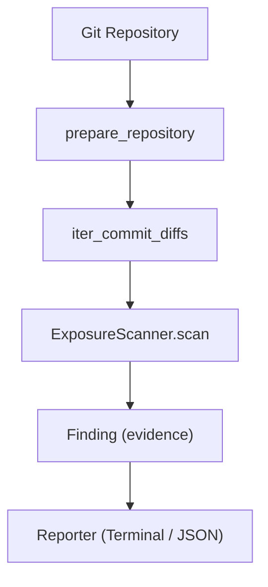

# AGENTS.md — Recon Repository Structure

## Overview

**Recon** is a Git security reconnaissance tool that scans Git history for exposed secrets and sensitive patterns. It operates in two modes:
- **Prevention**: Pre-commit hook to block secrets before they enter history
- **Forensics**: Historical scan of existing Git history for past exposures

---

## Repository Structure

```
recon/
├── AGENTS.md                    # This file
├── README.md                    # Concise visitor landing page
├── pyproject.toml               # Project config (uv, Python 3.13+, typer, questionary)
├── src/
│   └── recon/
│       ├── __init__.py
│       ├── cli.py               # Main CLI entry point (typer)
│       ├── scanner.py           # Core scanning orchestration
│       ├── models/
│       │   ├── __init__.py
│       │   ├── diff.py          # Git diff models (FileChange, FileDiff, Commit, CommitDiff)
│       │   └── findings.py      # Finding models (Finding, PathMatch, ContentMatch, LineType)
│       ├── detectors/
│       │   ├── __init__.py
│       │   ├── base.py          # Detector protocols (ContentDetector, PathDetector)
│       │   ├── content.py       # Regex-based content detection in diffs
│       │   └── path.py          # Regex-based path detection
│       ├── git/
│       │   ├── __init__.py
│       │   ├── repository.py    # Git repo validation, shallow/partial detection, unshallow
│       │   ├── refs.py          # Remote/local ref discovery (branches, tags, remotes)
│       │   ├── commits.py       # Commit metadata & reachable commit enumeration
│       │   ├── diff.py          # File change detection & patch extraction
│       │   ├── fetch.py         # Fetch operations (fetch-all, fetch-branch, fetch-remote)
│       │   └── traversal.py     # Commit diff iteration with deduplication
│       ├── commands/
│       │   ├── __init__.py
│       │   └── search_exposure.py  # CLI command: historical secret scanning
│       └── reporting/
│           ├── __init__.py
│           ├── terminal.py      # Human-readable terminal output
│           └── json.py          # JSON output for automation
├── tests/
│   ├── __init__.py
│   ├── conftest.py              # Pytest fixtures (git_repo, bare_repo, helpers)
│   ├── fixtures/
│   │   ├── __init__.py
│   │   └── git_repo.py          # Real Git repo fixtures & scenario builders
│   ├── test_repository.py       # Repo detection, shallow/partial handling
│   ├── test_refs.py             # Remote branch discovery, local refs, tags
│   ├── test_fetch.py            # Fetch operations
│   ├── test_commits.py          # Commit metadata, reachable commits, deduplication
│   ├── test_diff.py             # File change detection, patch extraction
│   ├── test_path_detector.py    # Path pattern matching
│   ├── test_content_detector.py # Content regex matching, line classification
│   ├── test_scanner.py          # End-to-end scanner integration
│   └── test_historical_semantics.py # Critical: secret lifecycle, branch scenarios, deduplication
└── docs/
    ├── architecture/            # Technical architecture docs
    └── mission/                 # Product mission & vision docs
```

---

## Key Architectural Concepts

### Data Flow



### Core Models

| Model | Purpose |
|-------|---------|
| `FileChange` | Single file change: status (added/modified/deleted/renamed/copied), old_path, new_path |
| `FileDiff` | FileChange + unified diff patch |
| `Commit` | Commit metadata: sha, author, timestamp, subject |
| `CommitDiff` | Commit + list of FileDiff |
| `PathMatch` | Evidence: pattern matched a file path |
| `ContentMatch` | Evidence: pattern matched diff content (with line type: addition/deletion/context) |
| `Finding` | Normalized finding: detector, commit info, paths, pattern, evidence |

### Detector Interface

```python
# PathDetector: matches against file paths (old_path, new_path)
PathDetector.from_patterns([r"\.env$", r"secret"])

# ContentDetector: matches against diff content, classifies line type
ContentDetector.from_patterns([r"PRIVATE_KEY=", r"API_KEY="])
```

Both return **evidence**, not classified secrets. Classification is a separate layer.

---

## Testing Strategy

| Layer | Files | Approach |
|-------|-------|----------|
| **Unit** | `test_path_detector.py`, `test_content_detector.py` | Pure function tests, no Git |
| **Integration** | `test_diff.py`, `test_commits.py`, `test_refs.py`, `test_fetch.py` | Real Git repos via subprocess |
| **End-to-end** | `test_scanner.py` | Full pipeline: repo → traversal → scanner → findings |
| **Semantic** | `test_historical_semantics.py` | **Critical**: Real-world secret lifecycles, branch scenarios, deduplication |

**Fixtures** (`tests/fixtures/git_repo.py`): Real Git repositories with scenario builders:
- `build_linear_history()` — secret added → rotated → renamed → deleted
- `build_branch_with_secret()` — secret only on feature branch
- `build_shared_commit()` — commit reachable from multiple branches

---

## CLI Commands

```bash
recon version                          # Show version
recon git fetch-all                    # Fetch all branches from all remotes
recon search_exposure -g 'PRIVATE_KEY=' [-p '\.env$'] [-a] [-f json] [--repo PATH] [refs...]
```

### search_exposure Options

| Option | Description |
|--------|-------------|
| `-g, --content-pattern` | Regex for diff content (repeatable) |
| `-p, --path-pattern` | Regex for file paths (repeatable) |
| `-a, --all-refs` | Scan all local/remote branches + tags |
| `-i, --interactive` | Interactive ref selection (not yet implemented) |
| `-f, --format` | `terminal` (default) or `json` |
| `--repo` | Repository path (default: cwd) |
| `refs` | Specific refs to scan (default: HEAD) |

---

## Development Commands

```bash
# Install dependencies
uv sync

# Run tests
uv run pytest

# Run tests with coverage
uv run pytest --cov=recon

# Run specific test file
uv run pytest tests/test_historical_semantics.py -v

# Type check
uv run basedpyright src/

# Lint
uv run ruff check src/ tests/

# Format
uv run ruff format src/ tests/

# Run CLI
uv run recon --help
uv run recon search_exposure -g 'PRIVATE_KEY='
```

---

## Extension Points (Future)

1. **Detector plugins** — New detector types (entropy, AST, structured tokens)
2. **Classifier** — Evidence → Finding classification (SECRET / REFERENCE / FALSE_POSITIVE)
3. **Plugin discovery** — Python entry points for external detector packages
4. **Pre-commit hook** — `recon scan` for staged changes
5. **History cleaning** — `recon clean <commit>` for history rewriting

---

## Key Files to Understand First

1. `README.md` — Product vision & architecture
2. `src/recon/scanner.py` — Core orchestration (48 lines)
3. `src/recon/models/findings.py` — Finding data model
4. `src/recon/detectors/content.py` — Content detection logic
5. `tests/test_historical_semantics.py` — Real-world test scenarios
6. `tests/fixtures/git_repo.py` — Test infrastructure

---

## Agent Development References

| File | Purpose |
|------|---------|
| `CONTRIBUTING.md` | **Start here** — Quick start for new detectors, workflow, test guidelines |
| `AGENT_GUIDE.md` | Comprehensive patterns: detector implementation, test layers, CLI wiring, common pitfalls |
| `docs/development/contributing.md` | Concise setup and contribution workflow |
| `docs/architecture/overview.md` | System architecture, data models, detector design, Git traversal |
| `docs/architecture/data-flow.md` | Stage-by-stage pipeline with code references |
| `docs/architecture/detectors.md` | Detector protocols, implementation details, future types |
| `docs/architecture/testing.md` | Test pyramid, fixtures, semantic test patterns |
| `docs/mission/vision.md` | Product vision, principles, roadmap, design decisions |
| `docs/mission/roadmap.md` | Phased roadmap (v0.2–v1.0), technical debt, risks |

**Golden Rule**: Use existing fixtures (`tests/fixtures/git_repo.py`) — never create test repos from scratch.
