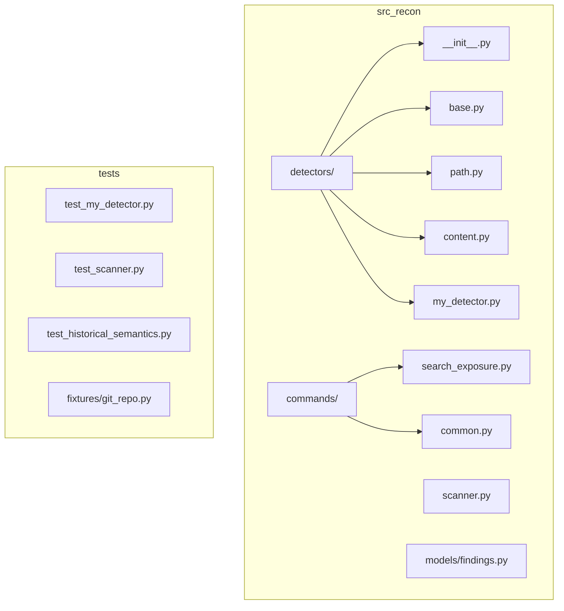

# Quick Reference — Recon Development Patterns

## Detector Template

```python
# src/recon/detectors/<name>.py
import re
from dataclasses import dataclass
from re import Pattern
from ..models import FileChange, PathMatch  # or ContentMatch, LineType

@dataclass(frozen=True, slots=True)
class <Name>Detector:
    patterns: tuple[Pattern[str], ...]

    @classmethod
    def from_patterns(cls, patterns: list[str] | tuple[str, ...]) -> "<Name>Detector":
        return cls(patterns=tuple(re.compile(p) for p in patterns))

    def detect(self, change: FileChange) -> tuple[PathMatch, ...]:  # or (patch: str) -> tuple[ContentMatch, ...]
        matches = []
        for item in items_to_check:
            for pattern in self.patterns:
                if pattern.search(item):
                    matches.append(MatchType(pattern=pattern.pattern, ...))
        return tuple(matches)
```

## Test Template — Unit

```python
# tests/test_<name>_detector.py
import pytest
from recon.detectors.<name> import <Name>Detector
from recon.models.findings import ContentMatch, LineType  # or PathMatch

class Test<Name>Detector:
    def test_basic_match(self):
        detector = <Name>Detector.from_patterns([r"PATTERN"])
        matches = detector.detect(input_data)
        assert len(matches) == 1
        assert matches[0].pattern == "PATTERN"

    def test_multiple_patterns(self):
        detector = <Name>Detector.from_patterns([r"PAT1", r"PAT2"])
        matches = detector.detect(input_with_both)
        assert {m.pattern for m in matches} == {"PAT1", "PAT2"}

    def test_empty_patterns(self):
        detector = <Name>Detector.from_patterns([])
        assert detector.detect(any_input) == ()
```

## Test Template — Integration

```python
# tests/test_scanner.py (add to TestScannerIntegration)
def test_scanner_finds_<name>_pattern(self, git_repo: Path) -> None:
    from tests.fixtures.git_repo import write_file, commit

    write_file(git_repo, "file.ext", "PATTERN=value\n")
    commit(git_repo, "Add pattern")

    findings = scan_repo(git_repo, <name>_patterns=[r"PATTERN="])
    assert len(findings) == 1
    assert findings[0].detector == "<name>"
    assert findings[0].evidence == "PATTERN=value"
```

## Test Template — Semantic

```python
# tests/test_historical_semantics.py (add new class)
class Test<Name>DetectorScenarios:
    def test_<name>_secret_lifecycle(self, git_repo: Path) -> None:
        from tests.fixtures.git_repo import build_linear_history
        # OR use write_file/commit/delete_file directly

        build_linear_history(git_repo)  # or custom scenario
        findings = scan_repo(git_repo, <name>_patterns=[r"PATTERN="])
        assert len(findings) >= expected_count
        # Verify specific commits detected

    def test_<name>_branch_isolation(self, git_repo: Path) -> None:
        from tests.fixtures.git_repo import build_branch_with_secret
        main_sha, feature_sha = build_branch_with_secret(git_repo)
        # Verify only feature branch has findings
```

## Scenario Builder Cheatsheet

```python
from tests.fixtures.git_repo import (
    # Basic ops
    write_file, commit, delete_file, rename_file,
    create_branch, checkout, run_git,

    # Scenario builders
    build_linear_history,      # C1→C2(add)→C3(mod)→C4(rename)→C5(del)
    build_branch_with_secret,  # main: clean, feature: secret
    build_shared_commit,       # A-B-C(main), B-D(feature)
    build_remote_with_branches,# multi-branch remote

    # Inspection
    get_head_sha, get_remote_branches, get_local_branches,
    get_local_remote_refs, get_local_tags,

    # Repo state
    is_shallow, make_shallow, push_to_remote, clone_repo,
)
```

## Linear History Scenario

```python
# build_linear_history creates:
# C1: initial
# C2: add .env with PRIVATE_KEY=secret1
# C3: modify .env → PRIVATE_KEY=secret2
# C4: rename .env → config/.env
# C5: delete config/.env
shas = build_linear_history(repo)
# shas = [c1, c2, c3, c4, c5]
```

## Branch with Secret Scenario

```python
# build_branch_with_secret creates:
# main:     C1 → C2 (clean)
# feature:  C1 → C2 → C3 (add secret) → C4 (remove secret)
main_sha, feature_sha = build_branch_with_secret(repo)
```

## Shared Commit Scenario

```python
# build_shared_commit creates:
# A -- B -- C (main)
#      \
#       D (feature)
# Commit B has SECRET=shared
main_sha, feature_sha, shared_sha = build_shared_commit(repo)
```

## Scan Helper (Copy to Test File)

```python
def scan_repo(
    repo_path: Path,
    path_patterns: list[str] | None = None,
    content_patterns: list[str] | None = None,
    my_patterns: list[str] | None = None,  # Add your patterns
    refs: list[str] | None = None,
) -> list[Finding]:
    import os
    from recon.git.repository import prepare_repository
    from recon.git.traversal import iter_commit_diffs
    from recon.detectors.path import PathDetector
    from recon.detectors.content import ContentDetector
    from recon.detectors.my_detector import MyDetector  # Your detector
    from recon.scanner import ExposureScanner
    from recon.models.findings import Finding

    original_cwd = os.getcwd()
    try:
        os.chdir(repo_path)
        prepare_repository(cwd=repo_path)
        refs = refs or ["HEAD"]

        path_detector = PathDetector.from_patterns(path_patterns) if path_patterns else None
        content_detector = ContentDetector.from_patterns(content_patterns) if content_patterns else None
        my_detector = MyDetector.from_patterns(my_patterns) if my_patterns else None

        scanner = ExposureScanner(
            path_detector=path_detector,
            content_detector=content_detector,
            my_detector=my_detector,
        )
        commits = iter_commit_diffs(refs, cwd=repo_path)
        return list(scanner.scan(commits))
    finally:
        os.chdir(original_cwd)
```

## CLI Option Template

```python
# In commands/search_exposure.py
my_pattern: Annotated[
    list[str],
    typer.Option(
        "-m", "--my-pattern",
        help="Regex for my custom pattern (repeatable).",
    ),
] = [],
```

## Detector Registration

```python
# src/recon/detectors/__init__.py
from .path import PathDetector
from .content import ContentDetector
from .my_detector import MyPathDetector, MyContentDetector

__all__ = [
    "PathDetector",
    "ContentDetector",
    "MyPathDetector",
    "MyContentDetector",
]
```

## Scanner Extension

```python
# src/recon/scanner.py
@dataclass(frozen=True, slots=True)
class ExposureScanner:
    path_detector: PathDetector | None = field(default=None, kw_only=True)
    content_detector: ContentDetector | None = field(default=None, kw_only=True)
    my_detector: MyContentDetector | None = field(default=None, kw_only=True)

    def _scan_commit(self, commit_diff: CommitDiff) -> Iterator[Finding]:
        for file_diff in commit_diff.files:
            change = file_diff.change
            # ... existing detectors ...
            if self.my_detector:
                for match in self.my_detector.detect(file_diff.patch):  # or .detect(change)
                    yield Finding.from_content_match(  # or from_path_match
                        match=match,
                        change=change,
                        commit_sha=commit_diff.commit.sha,
                        commit_subject=commit_diff.commit.subject,
                        author=commit_diff.commit.author,
                        timestamp=commit_diff.commit.timestamp,
                    )
```

## Common Assertions

```python
# Finding structure
assert finding.detector == "content"  # or "path", "my"
assert finding.commit_sha == expected_sha
assert finding.commit_subject == "commit message"
assert finding.author == "Test User <test@example.com>"
assert finding.timestamp is not None
assert finding.pattern == "PATTERN"
assert finding.evidence == "matched content"
assert finding.old_path == "old/path"  # or None
assert finding.new_path == "new/path"  # or None

# ContentMatch structure
assert match.line_type == LineType.ADDITION  # DELETION, CONTEXT
assert match.line_number > 0
assert match.line == "matched line content"

# PathMatch structure
assert match.path == "matched/path"
```

## Run Commands

```bash
# Single test
uv run pytest tests/test_historical_semantics.py::TestLinearHistory::test_linear_history_secret_lifecycle -v

# All tests
uv run pytest

# With coverage
uv run pytest --cov=recon

# Type check
uv run basedpyright src/

# Lint + format
uv run ruff check src/ tests/ && uv run ruff format src/ tests/
```

## File Structure

