# Data Flow Architecture

The scanning boundary is context based: for each file in each reachable commit,
`ExposureScanner` constructs one immutable `DetectionContext` and supplies it to
every configured detector. Each returned `Evidence` item is passed through the
ordered classifier sequence and combined with commit and path metadata in a
`Finding`.

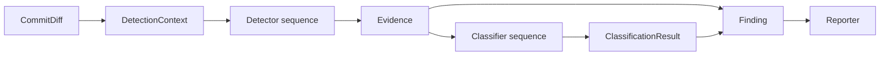

An evidence item always creates exactly one finding. Multiple evidence items from
one detector create multiple traceable findings. An absent or inconclusive
classifier produces `UNKNOWN`; the scanner does not silently promote evidence to
a secret.

## End-to-End Flow

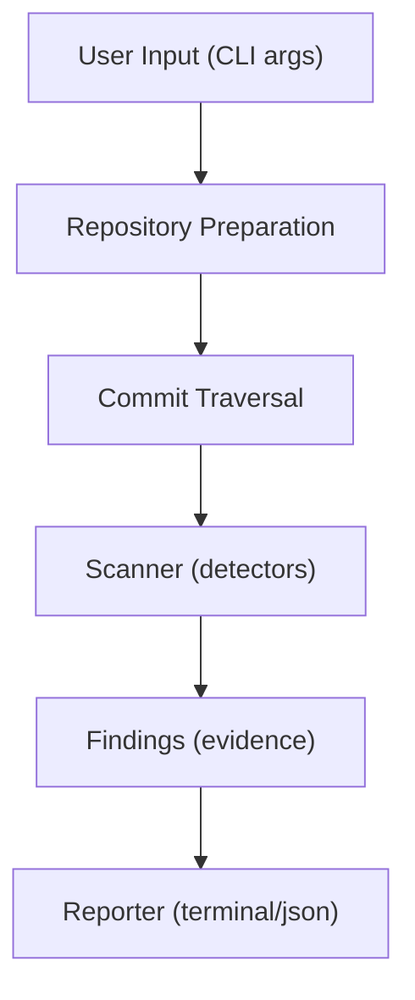

## Stage 1: Repository Preparation

**Entry**: `prepare_repository(cwd)` in `git/repository.py`

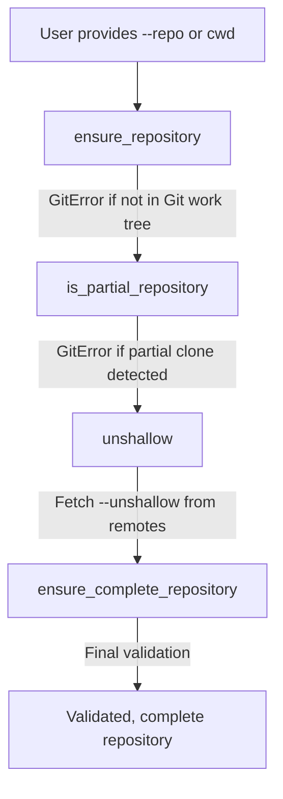

**Output**: Validated, complete repository ready for historical analysis

---

## Stage 2: Ref Resolution

**Entry**: `_resolve_refs()` in `commands/search_exposure.py`

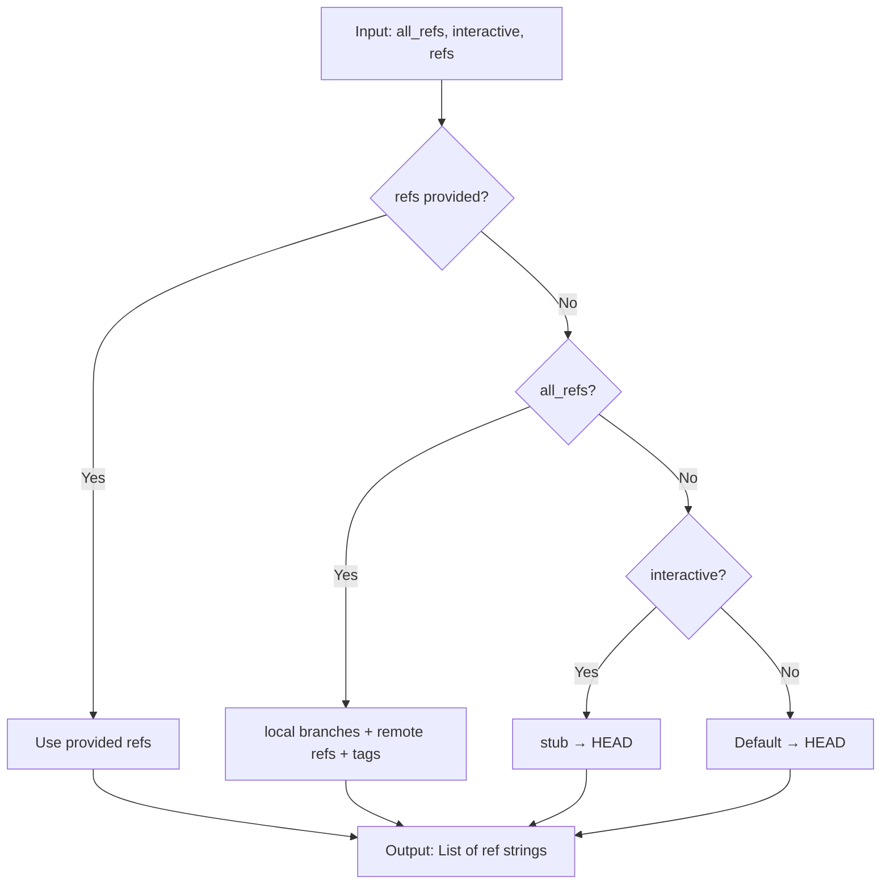

**Output**: List of ref strings (branch names, tag names, commit SHAs)

---

## Stage 3: Commit Traversal

**Entry**: `iter_commit_diffs(refs, cwd)` in `git/traversal.py`

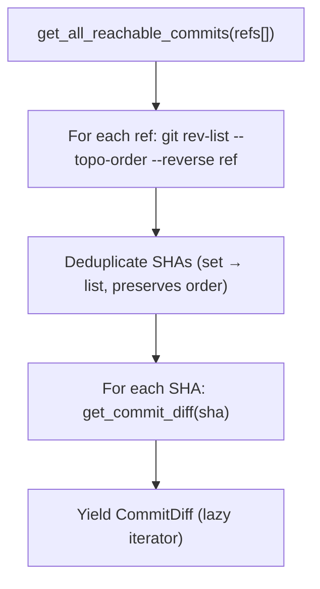

### Commit Diff Construction (`git/commits.py` → `git/diff.py`)

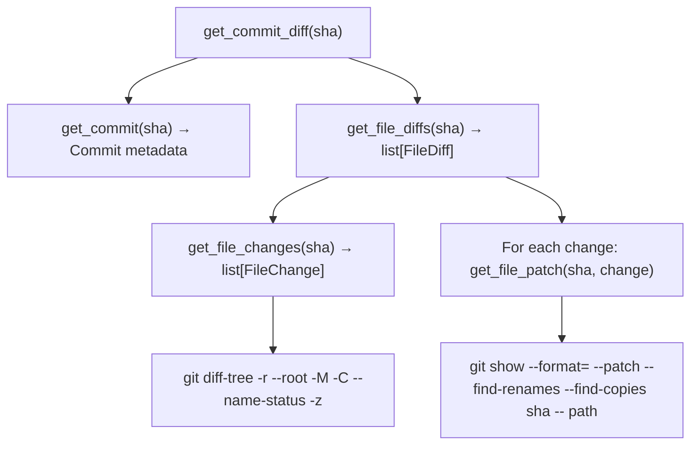

**Output**: `Iterator[CommitDiff]` — lazy, newest-first, deduplicated

---

## Stage 4: Scanning

**Entry**: `ExposureScanner.scan(commits)` in `scanner.py`

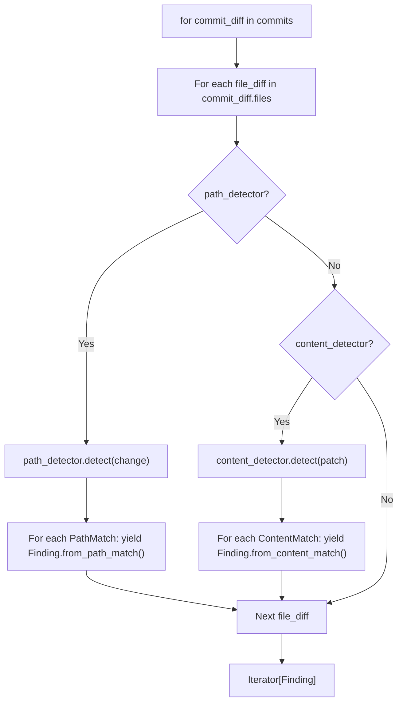

### Path Detection (`detectors/path.py`)

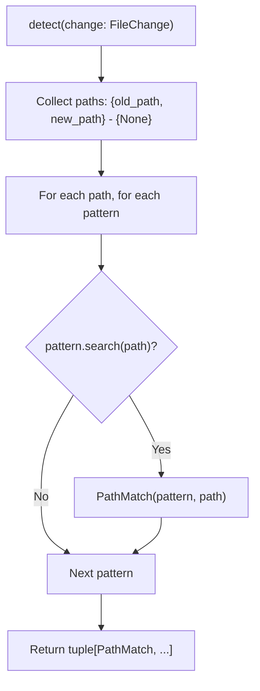

### Content Detection (`detectors/content.py`)

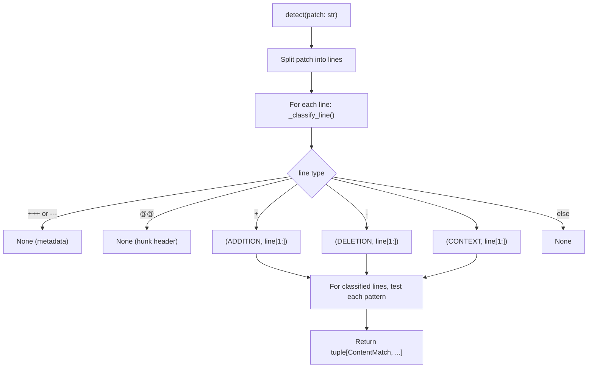

---

## Stage 5: Finding Construction

**Entry**: `Finding.from_path_match()` / `Finding.from_content_match()` in `models/findings.py`

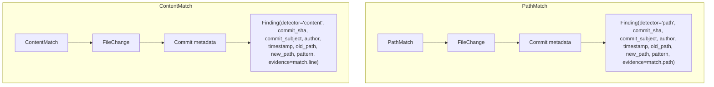

---

## Stage 6: Reporting

### Terminal Reporter (`reporting/terminal.py`)

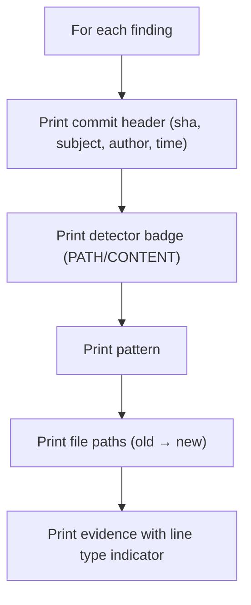

### JSON Reporter (`reporting/json.py`)

```json
{
  "findings": [
    {
      "detector": "content",
      "commit_sha": "abc123",
      "commit_subject": "Add config",
      "author": "User <email>",
      "timestamp": "2024-01-15T10:30:00Z",
      "old_path": null,
      "new_path": "config.env",
      "pattern": "PRIVATE_KEY=",
      "evidence": "PRIVATE_KEY=secret123"
    }
  ],
  "summary": {
    "total": 1,
    "by_detector": {"content": 1, "path": 0}
  }
}
```

---

## Data Flow Summary

| Stage | Input | Output | Key Function |
|-------|-------|--------|--------------|
| 1. Repo Prep | Path | Validated repo | `prepare_repository()` |
| 2. Ref Resolution | CLI args | `list[str]` refs | `_resolve_refs()` |
| 3. Traversal | Refs | `Iterator[CommitDiff]` | `iter_commit_diffs()` |
| 4. Scanning | `Iterator[CommitDiff]` | `Iterator[Finding]` | `ExposureScanner.scan()` |
| 5. Findings | Matches + metadata | `Finding` objects | `Finding.from_*_match()` |
| 6. Reporting | `list[Finding]` | stdout / JSON | `Reporter.report()` |

---

## Error Handling

| Stage | Failure Mode | Handling |
|-------|--------------|----------|
| Repo prep | Not a Git repo | `GitError` → CLI exit 1 |
| Repo prep | Partial clone | `GitError` with remediation hint |
| Repo prep | Shallow, no remote | `GitError` → CLI exit 1 |
| Traversal | Invalid ref | `GitError` from `git rev-list` |
| Diff extraction | Binary file | Empty patch, no crash |
| Detection | Malformed diff | Graceful skip (metadata filtered) |
| Reporting | I/O error | Propagate to CLI |
