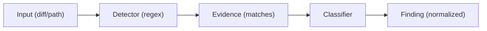
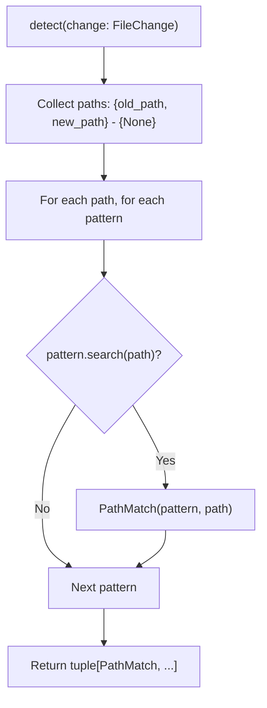
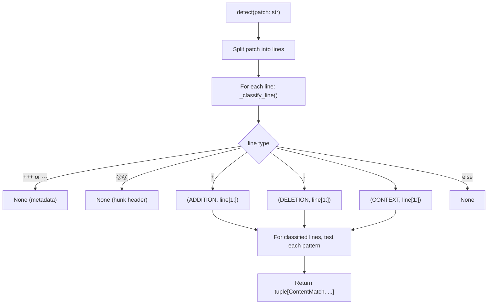
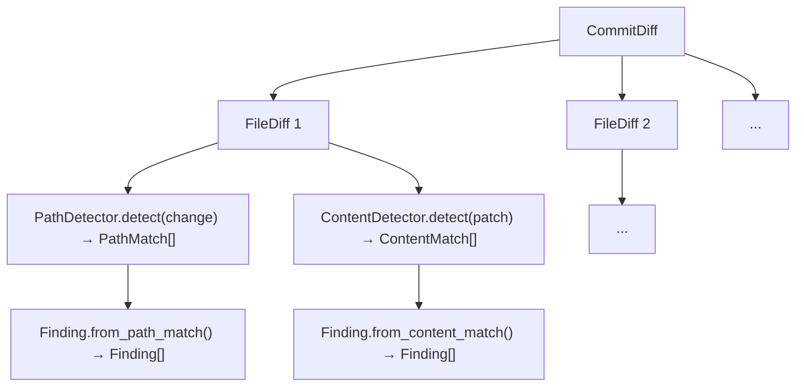

# Detector Architecture

## Detection and Classification Contract

The production pipeline is deliberately split into four stages:

```text
Detector -> Evidence -> ClassificationResult -> Finding
```

Every detector receives the same immutable `DetectionContext`, containing the
current `Commit` and `FileDiff`. A detector has a stable `name` and returns zero
or more immutable `Evidence` objects. The scanner rejects evidence whose detector
ID does not match that name, preventing findings from being attributed to the
wrong implementation.

Classifiers receive both the evidence and its original context. They run in the
configured order; the first result other than `UNKNOWN` wins. If every classifier
returns `UNKNOWN`, the first such result is retained. With no classifiers, the
scanner creates an `UNKNOWN` result with zero confidence.

`Evidence.value` is detector-internal candidate data. Reporters consume
`Evidence.redacted_value` through `Finding.evidence`; they must not display the raw
value. A finding retains the exact evidence and classification result so each
decision is traceable. Confidence is bounded to the inclusive range 0.0–1.0.

The original path and content regex matchers remain available as small, pure
matchers. `RegexPathDetector` and `RegexContentDetector` adapt them to the new
contract. New detectors should implement the generic contract directly rather
than adding detector-specific branches to the scanner.

## Design Philosophy

**Detectors produce evidence, not verdicts.**



This separation:
- Keeps detectors simple and composable
- Allows sophisticated classification later (ML, context-aware)
- Prevents false confidence from regex matches
- Enables multiple classifiers for same evidence

---

## Detector Protocol

```python
# detectors/base.py

class Detector(Protocol):
    name: str
    def detect(self, context: DetectionContext) -> Iterable[Evidence]: ...

class Classifier(Protocol):
    def classify(
        self, evidence: Evidence, context: DetectionContext
    ) -> ClassificationResult: ...
```

Detectors return an iterable of immutable evidence objects.

---

## Path Detector

### Implementation: `detectors/path.py`

```python
@dataclass(frozen=True, slots=True)
class PathDetector:
    patterns: tuple[Pattern[str], ...]

    @classmethod
    def from_patterns(cls, patterns: list[str] | tuple[str, ...]) -> "PathDetector":
        return cls(patterns=tuple(re.compile(p) for p in patterns))

    def detect(self, change: FileChange) -> tuple[PathMatch, ...]:
        paths = {p for p in (change.old_path, change.new_path) if p}
        matches = []
        for path in paths:
            for pattern in self.patterns:
                if pattern.search(path):
                    matches.append(PathMatch(pattern=pattern.pattern, path=path))
        return tuple(matches)
```

### Flow



### Behavior

| Aspect | Detail |
|--------|--------|
| **Input** | `FileChange` with `old_path` and/or `new_path` |
| **Matching** | Both paths checked; deduplicated by path |
| **Patterns** | Compiled regex; case-sensitive by default |
| **Output** | `tuple[PathMatch]` — one per (pattern, path) pair |
| **Rename handling** | Matches both old and new paths |

### PathMatch Evidence

```python
@dataclass(frozen=True, slots=True)
class PathMatch:
    pattern: str    # The regex pattern that matched
    path: str       # The file path that matched
```

### Example

```python
detector = PathDetector.from_patterns([r"\.env$", r"secret"])

# Rename: .env → config.json
change = FileChange(status=RENAMED, old_path=".env", new_path="config.json")
matches = detector.detect(change)
# → [PathMatch(pattern=r"\.env$", path=".env")]
```

---

## Content Detector

### Implementation: `detectors/content.py`

```python
@dataclass(frozen=True, slots=True)
class ContentDetector:
    patterns: tuple[Pattern[str], ...]

    @classmethod
    def from_patterns(cls, patterns: list[str] | tuple[str, ...]) -> "ContentDetector":
        return cls(patterns=tuple(re.compile(p) for p in patterns))

    def detect(self, patch: str) -> tuple[ContentMatch, ...]:
        matches = []
        for line_number, raw_line in enumerate(patch.splitlines(), start=1):
            line_type, content = self._classify_line(raw_line)
            if line_type is None:
                continue  # Skip Git metadata
            for pattern in self.patterns:
                if pattern.search(content):
                    matches.append(ContentMatch(
                        pattern=pattern.pattern,
                        line=content,
                        line_type=line_type,
                        line_number=line_number,
                    ))
        return tuple(matches)
```

### Line Classification

```python
@staticmethod
def _classify_line(line: str) -> tuple[LineType | None, str]:
    if line.startswith("+++ ") or line.startswith("--- "):
        return None, line          # File headers
    if line.startswith("@@"):
        return None, line          # Hunk headers
    if line.startswith("+"):
        return LineType.ADDITION, line[1:]
    if line.startswith("-"):
        return LineType.DELETION, line[1:]
    if line.startswith(" "):
        return LineType.CONTEXT, line[1:]
    return None, line              # Unknown/malformed
```

### Flow



### Behavior

| Aspect | Detail |
|--------|--------|
| **Input** | Unified diff patch string |
| **Line types** | ADDITION (`+`), DELETION (`-`), CONTEXT (` `) |
| **Metadata filtered** | `diff --git`, `---`, `+++`, `@@` |
| **Binary patches** | Handled gracefully (no matches) |
| **Line numbers** | 1-indexed within patch |
| **Multiple patterns** | Each pattern tested independently |

### ContentMatch Evidence

```python
@dataclass(frozen=True, slots=True)
class ContentMatch:
    pattern: str
    line: str
    line_type: LineType
    line_number: int | None
```

### Example

```python
detector = ContentDetector.from_patterns([r"PRIVATE_KEY=", r"API_KEY="])

patch = """diff --git a/config.env b/config.env
--- a/config.env
+++ b/config.env
@@ -1 +1 @@
-PRIVATE_KEY=old
+PRIVATE_KEY=new
"""

matches = detector.detect(patch)
# → [
#     ContentMatch(pattern="PRIVATE_KEY=", line="PRIVATE_KEY=old", line_type=DELETION, line_number=4),
#     ContentMatch(pattern="PRIVATE_KEY=", line="PRIVATE_KEY=new", line_type=ADDITION, line_number=5),
# ]
```

---

## Finding Construction

### From Path Match

```python
@classmethod
def from_path_match(cls, *, match: PathMatch, change: FileChange, ...) -> "Finding":
    return cls(
        detector="path",
        commit_sha=...,
        commit_subject=...,
        author=...,
        timestamp=...,
        old_path=change.old_path,
        new_path=change.new_path,
        pattern=match.pattern,
        evidence=match.path,
    )
```

### From Content Match

```python
@classmethod
def from_content_match(cls, *, match: ContentMatch, change: FileChange, ...) -> "Finding":
    return cls(
        detector="content",
        commit_sha=...,
        commit_subject=...,
        author=...,
        timestamp=...,
        old_path=change.old_path,
        new_path=change.new_path,
        pattern=match.pattern,
        evidence=match.line,
    )
```

### Finding Model

```python
@dataclass(frozen=True, slots=True)
class Finding:
    detector: str           # "path" or "content"
    commit_sha: str
    commit_subject: str
    author: str
    timestamp: str
    old_path: str | None
    new_path: str | None
    pattern: str
    evidence: str           # Matched path or diff line
```

---

## Scanner Orchestration

### Implementation: `scanner.py`

```python
@dataclass(frozen=True, slots=True)
class ExposureScanner:
    path_detector: PathDetector | None = field(default=None, kw_only=True)
    content_detector: ContentDetector | None = field(default=None, kw_only=True)

    def scan(self, commits: Iterable[CommitDiff]) -> Iterator[Finding]:
        for commit in commits:
            yield from self._scan_commit(commit)

    def _scan_commit(self, commit_diff: CommitDiff) -> Iterator[Finding]:
        for file_diff in commit_diff.files:
            change = file_diff.change

            if self.path_detector:
                for match in self.path_detector.detect(change):
                    yield Finding.from_path_match(...)

            if self.content_detector:
                for match in self.content_detector.detect(file_diff.patch):
                    yield Finding.from_content_match(...)
```

### Flow



---

## Future Detector Types

The protocol design supports extensibility:

```python
# Entropy-based detection
class EntropyDetector:
    def detect(self, patch: str) -> tuple[ContentMatch, ...]:
        # High-entropy strings in additions
        ...

# AST-aware detection
class ASTDetector:
    def detect(self, context: DetectionContext) -> tuple[Evidence, ...]:
        # Parse code, find password = "..." assignments
        ...

# Structured token detection
class StructuredTokenDetector:
    def detect(self, patch: str) -> tuple[ContentMatch, ...]:
        # AWS keys, JWTs, mnemonic phrases with validation
        ...

# Custom detector protocol
class CustomDetector(Protocol):
    name: str
    def detect(self, context: DetectionContext) -> Iterable[Evidence]: ...
```

---

## Testing Strategy

### Unit Tests (No Git)

- `test_path_detector.py` — Pure regex matching logic
- `test_content_detector.py` — Line classification, pattern matching

### Integration Tests (Real Git)

- `test_scanner.py` — End-to-end with real commits
- `test_historical_semantics.py` — Real-world scenarios

### Key Test Cases

| Detector | Test Coverage |
|----------|---------------|
| Path | Exact match, regex, multiple patterns, old/new paths, rename, case sensitivity |
| Content | Addition/deletion/context lines, metadata filtering, multiple patterns, binary patches, line numbers |

---

## Configuration

Patterns provided via CLI:

```bash
# Path patterns
recon search_exposure -p '\.env$' -p 'secret' -p 'credential'

# Content patterns
recon search_exposure -g 'PRIVATE_KEY=' -g 'API_KEY=' -g 'MNEMONIC='
```

Both are repeatable; combined with AND logic (all patterns tested).
