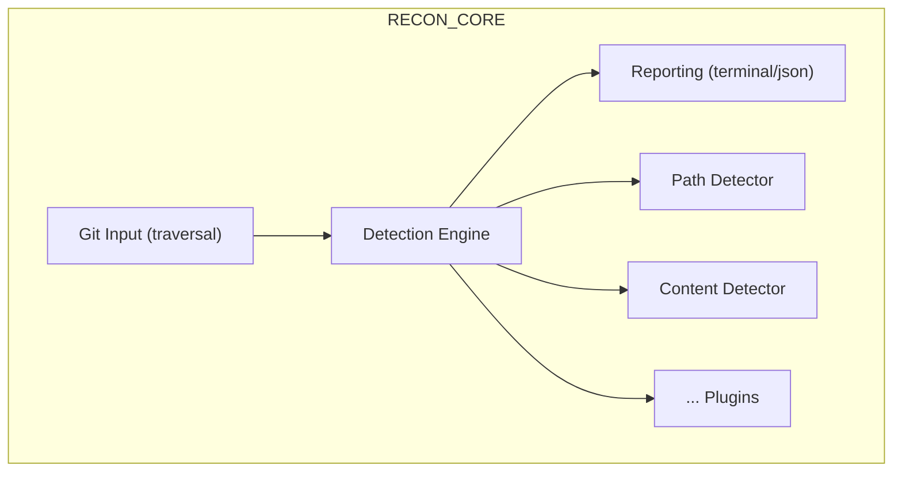
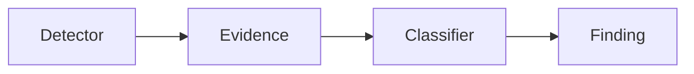
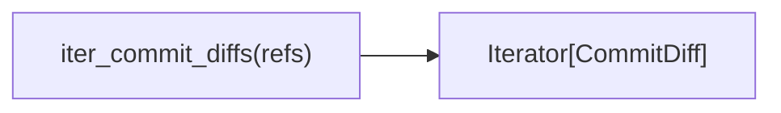
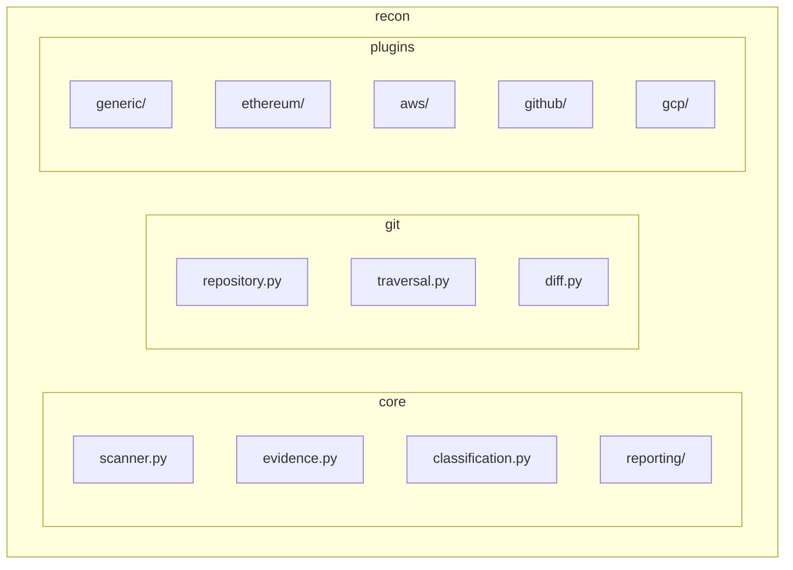

# Architecture Overview

## System Context

Recon is a Git security reconnaissance tool with two operational modes:
 


## Core Design Principles

### 1. Evidence over Classification

Detectors produce **evidence**, not verdicts:



- **Evidence**: "Pattern X matched at line Y in commit Z"
- **Finding**: Normalized record with commit metadata, paths, pattern, evidence
- **Classification** (future): SECRET / REFERENCE / FALSE_POSITIVE

This keeps the system intellectually honest — a regex match is not a secret.

### 2. Git as Source of Truth

- No mocking Git in tests — real `git` subprocess calls
- Real repositories with real history for integration tests
- Validates against actual Git behavior (renames, copies, shallow clones)

### 3. Lazy, Deduplicated Traversal



- Newest-first ordering
- Deduplicates commits reachable from multiple refs
- Memory-efficient streaming

### 4. Separation of Concerns

| Module | Responsibility |
|--------|----------------|
| `git/repository.py` | Repo validation, shallow/partial detection |
| `git/refs.py` | Remote/local ref discovery |
| `git/commits.py` | Commit metadata, reachable enumeration |
| `git/diff.py` | File changes, patch extraction |
| `git/traversal.py` | Commit iteration with deduplication |
| `detectors/` | Pattern matching (path + content) |
| `scanner.py` | Orchestration: commit → file diffs → detectors → findings |
| `reporting/` | Output formatting |

---

## Data Models

### Git Diff Models (`models/diff.py`)

```python
@dataclass
class FileChange:
    status: ChangeStatus      # ADDED, MODIFIED, DELETED, RENAMED, COPIED
    old_path: str | None
    new_path: str | None

@dataclass
class FileDiff:
    change: FileChange
    patch: str                # Unified diff

@dataclass
class Commit:
    sha: str
    author: str
    timestamp: datetime
    subject: str
    files: tuple[str, ...]    # File paths (legacy)

@dataclass
class CommitDiff:
    commit: Commit
    files: list[FileDiff]
```

### Finding Models (`models/findings.py`)

```python
class LineType(Enum):
    ADDITION = "addition"
    DELETION = "deletion"
    CONTEXT = "context"

@dataclass
class PathMatch:
    pattern: str
    path: str

@dataclass
class ContentMatch:
    pattern: str
    line: str
    line_type: LineType
    line_number: int | None

@dataclass
class Finding:
    detector: str             # "path" or "content"
    commit_sha: str
    commit_subject: str
    author: str
    timestamp: str
    old_path: str | None
    new_path: str | None
    pattern: str
    evidence: str             # The matched path or line
```

---

## Detector Architecture

### Protocol (`detectors/base.py`)

```python
class PathDetector(Protocol):
    def detect(self, change: FileChange) -> tuple[PathMatch, ...]: ...

class ContentDetector(Protocol):
    def detect(self, patch: str) -> tuple[ContentMatch, ...]: ...
```

### Path Detector (`detectors/path.py`)

- Matches regex against `old_path` and `new_path`
- Deduplicates matches for same path
- Case-sensitive by default, supports compiled regex with flags

### Content Detector (`detectors/content.py`)

- Parses unified diff format
- Classifies lines: `+` → ADDITION, `-` → DELETION, ` ` → CONTEXT
- Ignores Git metadata (`diff --git`, `---`, `+++`, `@@`)
- Handles binary patches gracefully
- Tracks line numbers within patch

---

## Git Traversal

### Commit Enumeration (`git/commits.py`)

```python
get_reachable_commits(ref) → list[str]        # SHAs, newest first
get_all_reachable_commits(refs) → list[str]   # Deduplicated across refs
```

Uses `git rev-list --topo-order --reverse` for topological ordering.

### Diff Iteration (`git/traversal.py`)

```python
iter_commit_diffs(refs) → Iterator[CommitDiff]
```

1. Get all reachable commits (deduplicated)
2. For each commit: `get_commit_diff(sha)` → `CommitDiff`
3. `get_commit_diff` builds `FileDiff` for each changed file

### File Diff Extraction (`git/diff.py`)

```python
get_file_changes(commit) → list[FileChange]
get_file_patch(commit, change) → str
get_file_diffs(commit) → list[FileDiff]
```

Uses `git diff-tree -r --root -M -C --name-status -z` for rename/copy detection.

---

## Repository Preparation (`git/repository.py`)

```python
prepare_repository(cwd) → None
```

Validates:
1. Inside a Git work tree
2. Not a partial clone (`extensions.partialClone` or `remote.*.promisor`)
3. Not shallow — or can be unshallowed via configured remote

---

## Reporting

### Terminal Reporter (`reporting/terminal.py`)

Human-readable output with colors, grouped by commit.

### JSON Reporter (`reporting/json.py`)

Machine-readable output for automation/CI.

---

## CLI Structure

```mermaid
flowchart TD
    A[recon] --> B[version]
    A --> C[git]
    C --> D[fetch-all]
    A --> E[search_exposure]
    E --> F[-p, --path-pattern (repeatable)]
    E --> G[-g, --content-pattern (repeatable)]
    E --> H[-a, --all-refs]
    E --> I[-i, --interactive (stub)]
    E --> J[-f, --format (terminal|json)]
    E --> K[--repo PATH]
    E --> L[[refs...]]
```

---

## Future Plugin Architecture



**Detector Interface** (not regex-specific):

```python
class Detector(Protocol):
    name: str
    def detect(self, context: DetectionContext) -> Iterable[Evidence]: ...

class DetectionContext:
    path: str | None
    diff: str | None
    blob: bytes | None
```

---

## Security Considerations

1. **No secrets in code** — Patterns are user-provided
2. **Complete history required** — Shallow/partial clones rejected
3. **Evidence preserved** — Original matched content in findings
4. **No auto-classification** — Human review required
5. **Local-only** — No network calls except Git operations