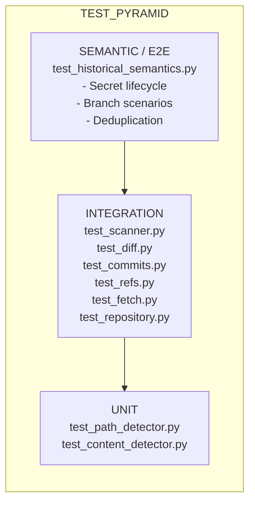
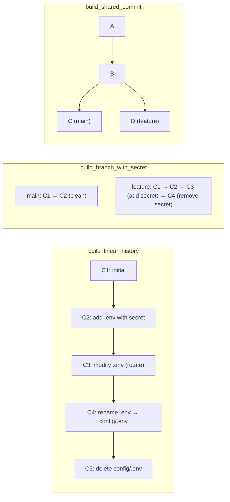
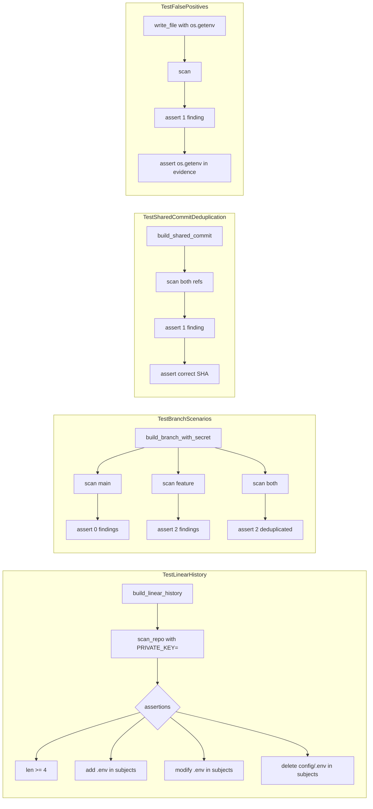

# Testing Architecture

## Philosophy

**Test real behavior, not mocks.**

- Real Git repositories via subprocess
- Real commits, branches, renames, deletes
- Validates against actual Git behavior
- No mocking of Git internals

---
 
## Test Layers



---

## Fixture Infrastructure

### `tests/fixtures/git_repo.py`

**Real Git repository context managers:**

```python
@contextmanager
def temp_git_repo() -> Iterator[Path]:
    """Temp repo with main branch, test user config."""

@contextmanager
def temp_bare_repo() -> Iterator[Path]:
    """Bare repo for remote testing."""
```

**Git operation helpers:**

```python
def commit(repo, message, allow_empty=False) -> str
def write_file(repo, path, content) -> None
def delete_file(repo, path) -> None
def rename_file(repo, old, new) -> None
def create_branch(repo, name) -> None
def checkout(repo, ref) -> None
def run_git(*args, cwd) -> str
```

**Scenario builders (domain-specific):**

In addition to the lifecycle builders below, `build_merge_history` covers
diverged branches and a merge, while `build_unusual_path_history` covers spaces
and non-ASCII filenames. Traversal tests extend these shared builders rather than
creating private fixture repositories.



---

## Conftest Fixtures

### `tests/conftest.py`

```python
@pytest.fixture
def git_repo() -> Iterator[Path]:
    """Temp Git repo with main branch and test user config."""

@pytest.fixture
def bare_repo() -> Iterator[Path]:
    """Temp bare Git repo (for use as remote)."""

@pytest.fixture
def remote_with_branches(bare_repo, git_repo) -> list[tuple[str, str]]:
    """Bare remote with multiple branches pushed from working repo."""
    return build_remote_with_branches(bare_repo, git_repo)

@pytest.fixture
def cloned_repo(bare_repo, tmp_path) -> Iterator[Path]:
    """Clone of the bare remote."""
```

**Re-exports all helpers** for direct use in tests:
```python
__all__ = [
    "git_repo", "bare_repo", "remote_with_branches", "cloned_repo",
    "commit", "write_file", "delete_file", "rename_file",
    "create_branch", "checkout", "get_head_sha",
    "get_remote_branches", "get_local_branches", "get_local_remote_refs",
    "get_local_tags", "is_shallow", "make_shallow",
    "push_to_remote", "clone_repo",
    "build_linear_history", "build_branch_with_secret",
    "build_shared_commit", "build_remote_with_branches",
]
```

---

## Unit Tests

### `test_path_detector.py`

Pure function tests — no Git required.

```python
def test_path_detector_matches_exact_path():
    detector = PathDetector.from_patterns([r"secret\.txt$"])
    change = FileChange(ADDED, new_path="secret.txt")
    matches = detector.detect(change)
    assert len(matches) == 1

def test_path_detector_checks_both_old_and_new_paths():
    detector = PathDetector.from_patterns([r"\.env$"])
    change = FileChange(RENAMED, old_path="config.env", new_path="config.json")
    matches = detector.detect(change)
    assert matches[0].path == "config.env"
```

### `test_content_detector.py`

Pure function tests with handcrafted diff strings.

```python
def test_content_detector_matches_added_line():
    detector = ContentDetector.from_patterns([r"PRIVATE_KEY="])
    patch = "+PRIVATE_KEY=new\n"
    matches = detector.detect(patch)
    assert matches[0].line_type == LineType.ADDITION

def test_content_detector_ignores_git_metadata():
    detector = ContentDetector.from_patterns([r"diff"])
    patch = "diff --git a/b\n+diff = something\n"
    matches = detector.detect(patch)
    assert len(matches) == 1  # Only the added line
```

---

## Integration Tests

### `test_repository.py`

```python
def test_is_shallow_repository_true_for_shallow_clone(git_repo, tmp_path):
    # Create source repo with commit
    write_file(git_repo, "file.txt", "content\n")
    commit(git_repo, "initial")

    # Create shallow clone
    shallow_dir = tmp_path / "shallow"
    run_git("clone", "--depth", "1", "--no-single-branch", f"file://{git_repo}", str(shallow_dir))

    os.chdir(shallow_dir)
    assert is_shallow_repository() is True
```

### `test_refs.py`

```python
def test_get_remote_branches_discovers_all_branches(bare_repo, git_repo):
    pushed = build_remote_with_branches(bare_repo, git_repo)
    branches = get_remote_branches("origin", cwd=git_repo)
    assert {b.name for b in branches} == {"main", "feature/busd", "feature/security-config"}
```

### `test_commits.py`

```python
def test_get_all_reachable_commits_deduplicates(git_repo):
    main_sha, feature_sha, shared_sha = build_shared_commit(git_repo)
    commits = get_all_reachable_commits(["main", "feature"], cwd=git_repo)
    assert len(commits) == 4  # A, B, C, D — not 6
```

### `test_diff.py`

```python
def test_get_file_changes_detects_rename(git_repo):
    write_file(git_repo, "old.txt", "content\n")
    commit(git_repo, "Add old.txt")
    rename_file(git_repo, "old.txt", "new.txt")
    sha = commit(git_repo, "Rename")

    changes = get_file_changes(sha, cwd=git_repo)
    assert changes[0].status == ChangeStatus.RENAMED
    assert changes[0].old_path == "old.txt"
    assert changes[0].new_path == "new.txt"
```

### `test_fetch.py`

```python
def test_fetch_all_fetches_all_branches(bare_repo, git_repo):
    build_remote_with_branches(bare_repo, git_repo)
    fetched = fetch_all(cwd=git_repo)
    assert len(fetched) == 3
    assert {b.name for b in fetched} == {"main", "feature/busd", "feature/security-config"}
```

---

## End-to-End Tests

### `test_scanner.py`

Full pipeline: repo → traversal → scanner → findings.

```python
def scan_repo(repo_path, path_patterns=None, content_patterns=None, refs=None):
    """Helper: run full scan pipeline."""
    prepare_repository(cwd=repo_path)
    path_detector = PathDetector.from_patterns(path_patterns) if path_patterns else None
    content_detector = ContentDetector.from_patterns(content_patterns) if content_patterns else None
    detectors = tuple(
        detector
        for detector in (
            RegexPathDetector(path_detector) if path_detector else None,
            RegexContentDetector(content_detector) if content_detector else None,
        )
        if detector is not None
    )
    scanner = ExposureScanner(detectors=detectors)
    commits = iter_commit_diffs(refs or ["HEAD"], cwd=repo_path)
    return list(scanner.scan(commits))

def test_scanner_finds_secret_in_added_file(git_repo):
    write_file(git_repo, "config.env", "API_KEY=secret123\n")
    commit(git_repo, "Add config")
    findings = scan_repo(git_repo, content_patterns=[r"API_KEY="])
    assert len(findings) == 1
    assert findings[0].evidence == "API_KEY=secret123"
```

---

## Semantic Tests (Critical)

### `test_historical_semantics.py`

**Tests real-world secret exposure scenarios.**



```python
class TestLinearHistory:
    def test_linear_history_secret_lifecycle(self, git_repo):
        """
        C1: initial
        C2: add .env with secret
        C3: modify .env (rotate)
        C4: rename .env → config/.env
        C5: delete config/.env
        """
        build_linear_history(git_repo)
        findings = scan_repo(git_repo, content_patterns=[r"PRIVATE_KEY="])
        assert len(findings) >= 4
        subjects = {f.commit_subject for f in findings}
        assert "add .env" in subjects
        assert "modify .env" in subjects
        assert "delete config/.env" in subjects

class TestBranchScenarios:
    def test_secret_only_on_feature_branch(self, git_repo):
        main_sha, feature_sha = build_branch_with_secret(git_repo)
        findings_main = scan_repo(git_repo, content_patterns=[r"api_key"], refs=["main"])
        assert len(findings_main) == 0
        findings_feature = scan_repo(git_repo, content_patterns=[r"api_key"], refs=["feature"])
        assert len(findings_feature) == 2
        findings_both = scan_repo(git_repo, content_patterns=[r"api_key"], refs=["main", "feature"])
        assert len(findings_both) == 2  # Deduplicated

class TestSharedCommitDeduplication:
    def test_same_commit_reachable_from_two_branches(self, git_repo):
        main_sha, feature_sha, shared_sha = build_shared_commit(git_repo)
        findings = scan_repo(git_repo, content_patterns=[r"SECRET="], refs=["main", "feature"])
        assert len(findings) == 1
        assert findings[0].commit_sha == shared_sha

class TestFalsePositives:
    def test_env_var_reference_not_secret(self, git_repo):
        write_file(git_repo, "app.py", 'PRIVATE_KEY = os.getenv("PRIVATE_KEY")\n')
        commit(git_repo, "Add config loading")
        findings = scan_repo(git_repo, content_patterns=[r"PRIVATE_KEY"])
        assert len(findings) == 1
        assert 'os.getenv("PRIVATE_KEY")' in findings[0].evidence
        # Classification happens at higher layer
```

---

## Running Tests

```bash
# All tests
uv run pytest

# With coverage
uv run pytest --cov=recon

# Specific layer
uv run pytest tests/test_historical_semantics.py -v
uv run pytest tests/test_content_detector.py -v

# Verbose
uv run pytest -v

# Parallel (if pytest-xdist installed)
uv run pytest -n auto
```

---

## Test Quality Metrics

| Metric | Target |
|--------|--------|
| Unit test coverage | >90% |
| Integration coverage | All Git operations |
| Semantic coverage | All secret lifecycle scenarios |
| No flaky tests | Zero tolerance |
| Real Git usage | 100% (no mocks for Git) |

---

## Adding New Tests

1. **Unit**: Add to `test_path_detector.py` or `test_content_detector.py`
2. **Integration**: Add to appropriate `test_*.py` in `tests/`
3. **Semantic**: Add to `test_historical_semantics.py` with scenario builder
4. **New scenario**: Add builder to `tests/fixtures/git_repo.py`

---

## CI Integration

```yaml
# .github/workflows/test.yml
- name: Run tests
  run: uv run pytest --cov=recon --cov-fail-under=80
```
