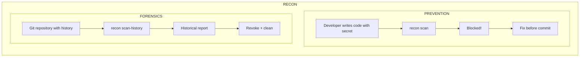
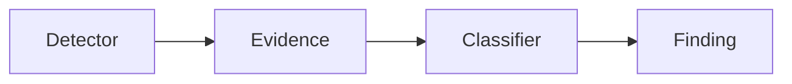

# Mission & Vision

## The Problem

**Git is a secret leak amplifier.**

Once a secret enters a commit:
- It persists in history forever
- `git rm` doesn't remove it from history
- Force-push rewriting is dangerous and disruptive
- Attackers scan public repos continuously
- Internal repos become attack surfaces when exposed

**Current tools fail because:**
- They scan working tree only (miss history)
- They classify matches as "secrets" (high false positives)
- They don't understand Git semantics (renames, branches, merges)
- They're not developer-friendly (slow, noisy, hard to integrate)

---

## The Vision

**Recon: Security reconnaissance for Git.**

Two modes, one engine:

---

## Core Principles

### 1. Evidence, Not Verdicts

A regex match is **evidence**, not a secret. Classification is a separate, pluggable layer.

### 2. Git-Native

- Understands renames, copies, merges, branches
- Traverses history correctly (topological order, deduplication)
- Handles shallow/partial clones properly
- Uses real Git, not approximations

### 3. Developer-First

- Fast enough for pre-commit (<100ms)
- Clear, actionable output
- Integrates with existing workflows
- No false confidence

### 4. Extensible

- Plugin architecture for detectors
- Organization-specific patterns without forking
- Multiple output formats (terminal, JSON, SARIF)

---

## Target Users

| User | Need | Recon Delivers |
|------|------|----------------|
| **Developer** | "Don't let me commit secrets" | `recon scan` in pre-commit hook |
| **Security Engineer** | "Find all historical exposures" | `recon scan-history -a` |
| **Incident Response** | "What was exposed in this breach?" | `recon scan-history <commit-range>` |
| **Platform Team** | "Enforce policy across org" | Centralized patterns, CI integration |

---

## Product Roadmap

### Phase 1: Core Scanner (Current)
- [x] Git traversal with deduplication
- [x] Path + content detectors (regex)
- [x] Terminal + JSON reporting
- [x] CLI: `search_exposure`, `git fetch-all`
- [x] Shallow/partial repo handling
- [x] Comprehensive test suite

### Phase 2: Prevention
- [ ] `recon scan` — scan staged changes
- [ ] Pre-commit hook installation
- [ ] Exit codes for CI integration
- [ ] Baseline/allowlist support

### Phase 3: Classification
- [ ] Evidence → Finding classifier
- [ ] SECRET / REFERENCE / FALSE_POSITIVE
- [ ] Confidence scoring
- [ ] Context-aware rules (test files, docs, examples)

### Phase 4: Plugin Ecosystem
- [ ] Detector plugin interface
- [ ] Built-in plugins: AWS, GitHub, Ethereum, JWT, GCP
- [ ] Entropy detector
- [ ] AST detector (language-aware)
- [ ] Entry point discovery

### Phase 5: Remediation
- [ ] `recon clean <commit>` — history rewriting
- [ ] Automated secret rotation guidance
- [ ] Integration with secret managers (Vault, AWS Secrets Manager)

### Phase 6: Enterprise
- [ ] Policy-as-code
- [ ] Centralized pattern management
- [ ] Audit logging
- [ ] SARIF output for GitHub/GitLab
- [ ] Multi-repo scanning

---

## Non-Goals

- **Secret storage** — Use Vault, AWS Secrets Manager, etc.
- **Secret rotation** — Out of scope; integrate with tools that do this
- **Runtime protection** — This is a Git tool, not a runtime agent
- **SAST/DAST** — Different problem space

---

## Success Metrics

| Metric | Target |
|--------|--------|
| Pre-commit latency | <100ms for typical repo |
| Historical scan | <30s for 10k commits |
| False positive rate | <5% after classification |
| Developer adoption | Zero-friction install |
| Pattern coverage | Extensible to any secret type |

---

## Design Decisions

### Why Python?

- Rich ecosystem for Git (`gitpython` alternative: subprocess)
- Excellent CLI framework (typer)
- Strong typing (dataclasses, protocols)
- Easy plugin entry points
- Ubiquitous in security tooling

### Why Regex First?

- Simplest detector to implement and understand
- Covers 80% of secret patterns (API_KEY=, PRIVATE_KEY=, etc.)
- User-extensible without code changes
- Foundation for more sophisticated detectors

### Why Not gitpython?

- Subprocess is more reliable for edge cases
- No dependency on Git binary version
- Easier to debug (exact commands visible)
- No abstraction leaks

### Why Evidence Over Classification?

- Regex matches ≠ secrets
- `PRIVATE_KEY = os.getenv("PRIVATE_KEY")` matches but isn't a secret
- Test fixtures match but aren't secrets
- Documentation examples match but aren't secrets
- Classification requires context (ML, heuristics, policy)

---

## Competitive Landscape

| Tool | Approach | Gap |
|------|----------|-----|
| **git-secrets** | Pre-commit, regex | No history scan, no classification |
| **truffleHog** | History + entropy | High false positives, slow |
| **gitleaks** | History, regex | No Git semantics (renames), no prevention |
| **detect-secrets** | Pre-commit, baseline | No history scan, baseline maintenance burden |
| **Recon** | **Both modes, Git-native, evidence-based** | — |

---

## Tagline Options

- "Git security reconnaissance"
- "Find secrets before they find you"
- "Your Git history's security scanner"
- "Evidence-based secret detection"